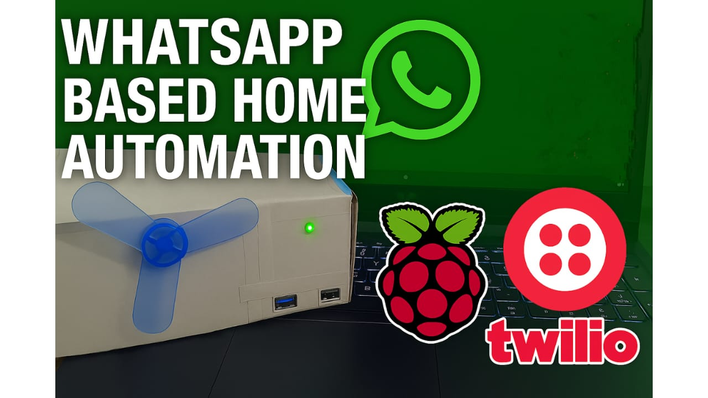

# whatsapp-home-automation-iot
# WhatsApp-Based Home Automation using Raspberry Pi

This IoT project lets you control light and fan using WhatsApp messages with Twilio API and Raspberry Pi.

## 💡 Features
- WhatsApp-based appliance control
- Real-time status updates
- Fully automated on boot
- Python Flask + Ngrok + gpiozero

## 🛠️ Components
- Raspberry Pi Zero 2 W
- L298N Motor Driver
- 5V DC Motor (Fan)
- LED with 220Ω resistor
- Twilio Sandbox API
- Python + Flask

## 📂 Files
- `whatsapp_bot.py`: Main bot logic
- `startup.sh`: Auto-launch + ngrok + Twilio update
- `requirements.txt`: Install dependencies

## 📷 Preview
Send: `light on`, `fan off` etc.  
Raspberry Pi activates GPIO devices and replies via WhatsApp.
video: "https://youtu.be/Oj13-Y8D_Ww?feature=shared"

